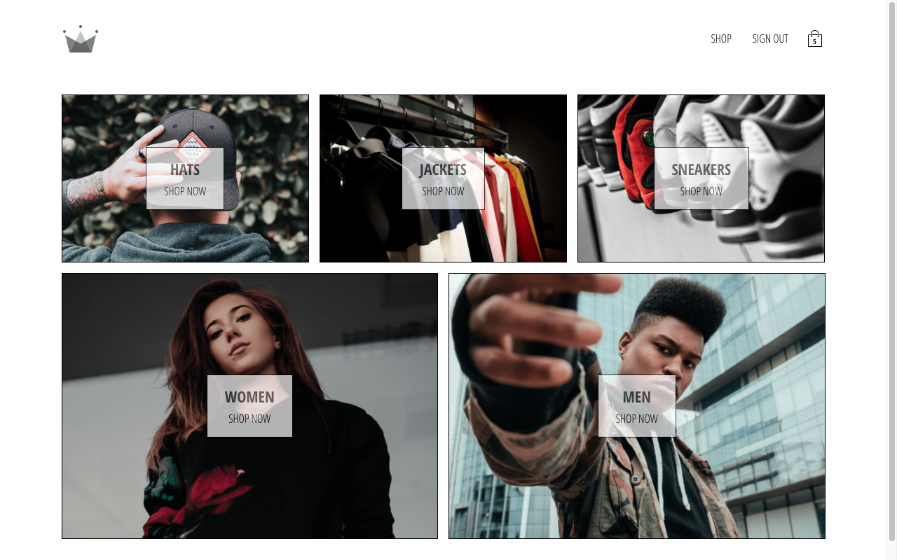

# Crown Clothing

A clothing e-commerce React app with features including: user sign-in and sign-up, user sessions, an interactive shopping basket, and card payment processing with [Stripe](https://stripe.com/) API. While most of the codebase is client-side, I implemented a Node.js server to serve static files and to process card payments securely with hidden API keys.

 

 

## This project uses the following front-end packages and libraries:

- [React.js](https://reactjs.org/) (UI library allowing the creation of resusable components while providing fast DOM manipulation)
- [Redux](https://redux.js.org/) (state manager that holds all state in a centralised store)
- [Redux-Saga](https://redux-saga.js.org/) (to handle asynchronous actions and side effects)
- [Reselect](https://github.com/reduxjs/reselect) (to create memoized state selectors)
- [React Router DOM](https://reactrouter.com/) (to simplify page routing and page redirects)
- [Firebase](https://firebase.google.com/) (to provide OAuth user authentication and to store and query user/shop data from a NoSQL database)
- [Axios](https://www.npmjs.com/package/axios) (to create simple HTTP requests to the back-end)
- [React Stripe Checkout](https://www.npmjs.com/package/react-stripe-checkout) (fast solution for creating Stripe payment portal)
- [Redux Persist](https://www.npmjs.com/package/redux-persist) (to store users cart items between sessions)
- [Styled Components](https://styled-components.com/) (to separate the concern of CSS styles into their own module for each component while avoiding global class name collisions)
- [lodash.memoize](https://www.npmjs.com/package/lodash.memoize) (used to memoize higher-order state selector functions)

 

## This project uses the following back-end packages, libraries, and technologies:

- [Node.js](https://nodejs.org/en/) (JavaScript runtime)
- [Express](https://expressjs.com/) (back-end web framework making it easier to handle HTTP requests)
- [dotenv](https://www.npmjs.com/package/dotenv) (to hide environment variables and secret keys)
- [compression](https://www.npmjs.com/package/compression) (to reduce the size of files sent to the client and therefore improve load times)
- [stripe](https://www.npmjs.com/package/stripe) (to authorize card payments with a secret Stripe key)
